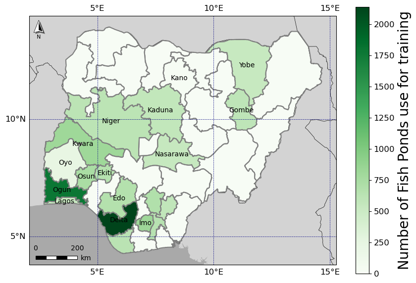

# FPAI

## What is the pipeline doing?
1. Select the state
2. Divide the state by grids of 6km $\times$ 6km
3. for every grid:\
   &emsp;&emsp; divide by grids of 200m $\times$ 200m (2000 $\times$ 2000 pixels), each grid has 900 images of this size\
   &emsp;&emsp; for every 2000 $\times$ 2000 pixels images:\
      &emsp;&emsp;&emsp; extract the corresponding Google XYZ tiles\
      &emsp;&emsp;&emsp; use the 'fine_tune_final_dataset_freeze_v02_2' yolov7 model to predict fishponds in the grid\
      &emsp;&emsp;&emsp; convert mask to polygons\
      &emsp;&emsp;&emsp; save shape file of polygons\
      &emsp;&emsp;&emsp; update num_predicitions\
   &emsp; save shape file of all polygons for grid\
   save shape file for predictions made on state
4. Extract features for Random Forest model

## How to run pipeline?
1. Requirements:
   The basis requirememts are:
   *  qgis=3.40.3
   *  geopandas=1.0.1
   *  folium=0.19.4
   *  pytorch=2.4.0
   *  rasterio=1.4.3
   *  ee=1.5.17 (Google Earth Engine API)
     
   The following files (in Pipeline/) include the detail packages:\
   `yolov7_qgis_2025_env.yml`\
   `yolov7_qgis_2025_explicit.txt`\
   `yolov7_qgis_2025_env_pip.txt` \
   `env_w_gee.yaml`
    
  3. Git clone https://github.com/taceroc/yolov7/tree/u7_tac_loss_gpu
  4. Download shape file of Nigeria division by states and save to data/Nigeria
  5. Download model 'fine_tune_ogun_delta_combine_freeze_v2' (feb 17/2025: google drive FishPonds)
  6. cd to Pipeline/
  7. Run pipeline by, replace STATE by your desired state, as listed in the shape file of Nigeria(1)
     * sbatch -J STATE pred_all_state_random.sh predict_random_grid.py STATE \
       If the job ended but not all state was covered, submit this job instead \
     * sbatch -J STATE pred_all_state_random.sh predict_random_grid.py STATE --continue_grid_search
       To predict over all grids (all state): \
     * sbatch -J STATE pred_all_state_random.sh predict_random_grid.py STATE --continue_grid_search --how_to_use True
       To predict over all grids (all state) but select a batch of 200 grids: \
     * sbatch -J STATE pred_all_state_random.sh predict_random_grid.py STATE --continue_grid_search --how_to_use none --batch_num a_number_between_0_and_total_num_batches \
       Once the state or the desired grids are covered generate the final predicitions shap file: \
     * sbatch -J STATE pred_all_state_random.sh predict_random_grid.py STATE --generate \
       Results would be on `Pipeline/data/STATE/STATE_all_geocoords.*`
  8. Once the prediction file is generated, it's time to extract the features for the random forest\
      sbatch -J STATE pred_all_state_features_rf.sh extract_all_features_rf.py STATE
      Results with all features would be on `Pipeline/data/STATE/STATE_inter_all_geocoords_time_series.*`.\
      There will also be intermediate files saved.\
  9. The same command will generate the final Random Forest prediction. Results would be on `Pipeline/data/STATE/STATE_inter_all_geocoords_time_series_wpred.*`\

(1)NOTE: States with two or more words should be written without the space, e.g: Cross River should be written as CrossRiver

# How data was collected?: Fish Pond Census

  
  Figure 1: Nigeria and its 36 geopolitical states. In color are the states considered for this work and where we have information of Fish Ponds location from the WorldFish census.

Figure: Map of Nigeria, the states are color coded by the number of fish ponds in the state used to train the segmentation model. Since more fish ponds were found in Delta and Ogun states, these two states contribute the most to the fish pond data set.

Figure: Distribution number of Fish Ponds per image in all the states considered. There are on average XX amount of annotated Fish Ponds per image; the image with less Fish Ponds has XX and the one with more has XX annotated Fish Ponds. For Ogun states the team annotated 4,951 across X number of images. Delta state 2,981 across Y number of images, other states (maybe a table if we have several states.)

Figure: Distribution of annotated Fish Pond area in m2 across all the states considered in this work. In average the area of the Fish Pond is XX m2, with some outliers whose size is >5,000m2.

# Feature extraction

|Feature | Description|Origin |
|-----|-------|------|
|ave\_r| average of red color for prediction | Google satellite images |
|ave\_g|  average of green color for prediction|  " "|
|ave\_b|  average of blue color for prediction| " "|
|std\_r|  standard deviation of red color for prediction| " "|
|std\_g|  standard deviation of green color for prediction| " "|
|std\_b|  standard deviation of blue color for prediction| " "|
|area| area of the prediction in meters| segmentation model prediction|
|length| perimeter of the prediction in meters| " " |
|isoperimetric ratio | how round is the prediction, 1 for circle | " "|
|NDVI\_pond[^1]/state[^2]/1km[^3] |  Normalized Difference Vegetation Index| Sentinel-2, Level-2A, GEE[^4]/ Python API |
|NDBI\_pond/state/1km |  Normalized Difference Built-up Index|" " |
|NDWI\_pond/state/1km |  Normalized Difference Water Index| " " |
|MSAVI\_pond/state/1km | Modified Soil Adjusted Vegetation Index|" " |

[^1]: for the area of the prediction
[^2]: for the state where the prediction is located
[^3]: 1km$^{2}$ around the prediction
[^4]: Google Earth Engine. Sentinel data was extracted from the period between November and December 2023.

  

