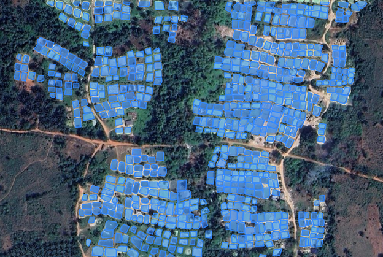
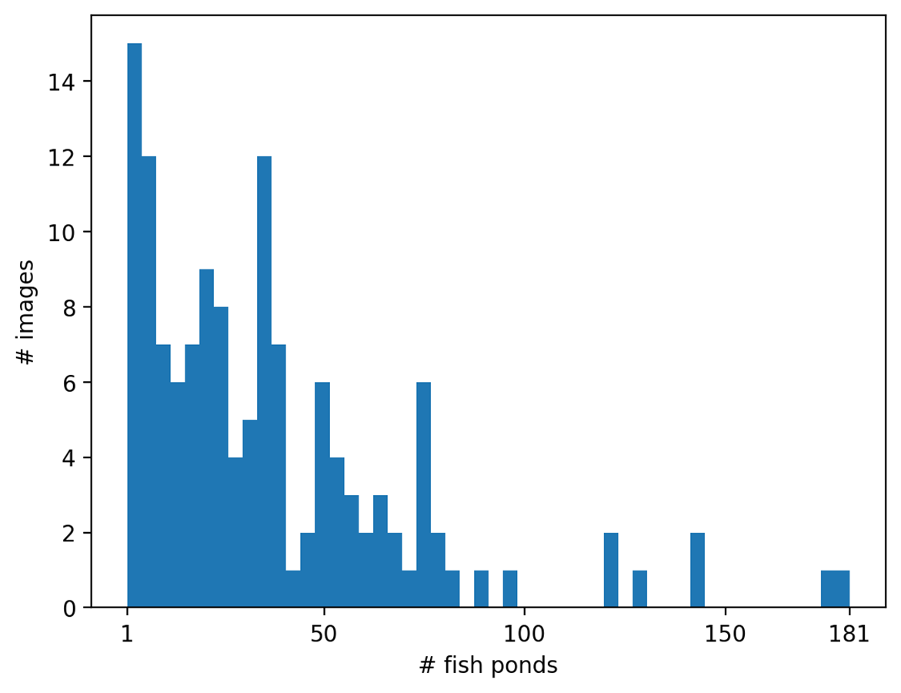
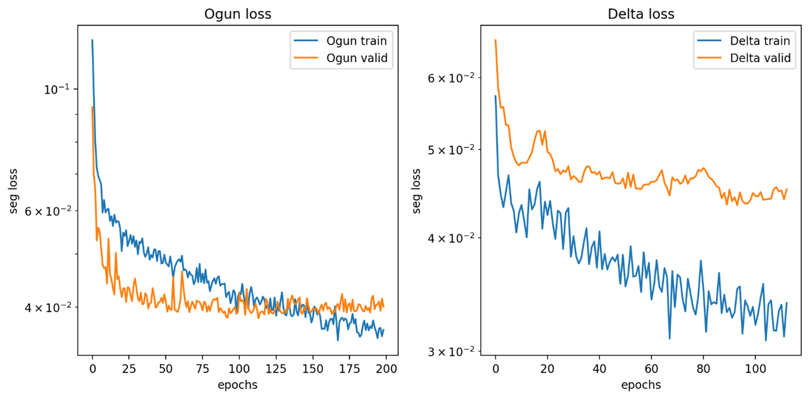
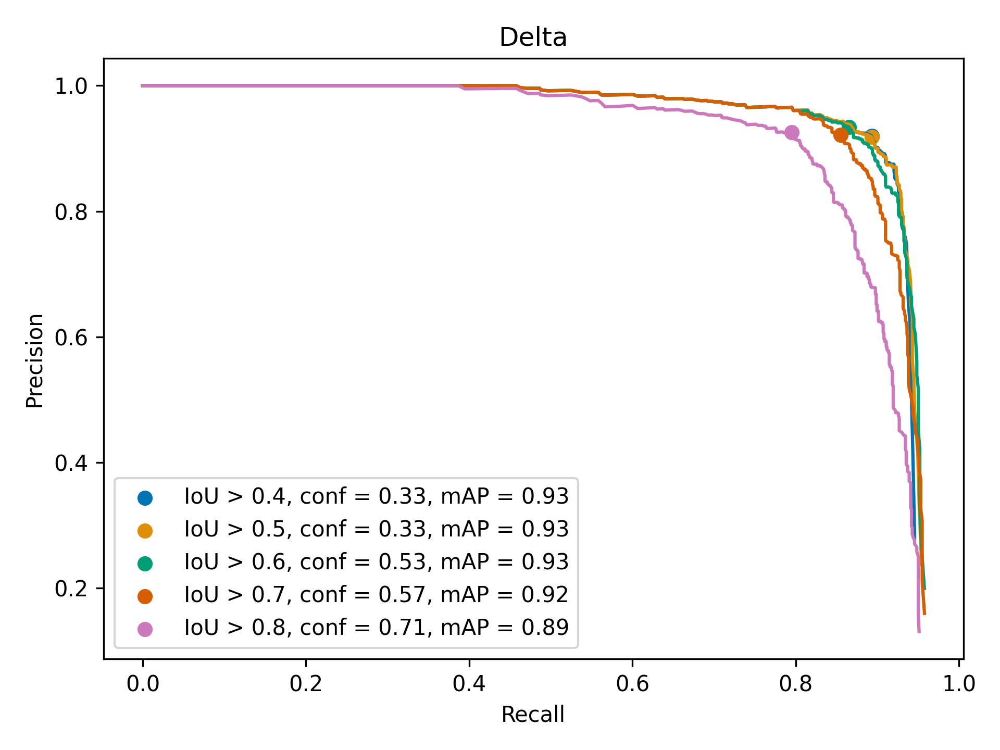
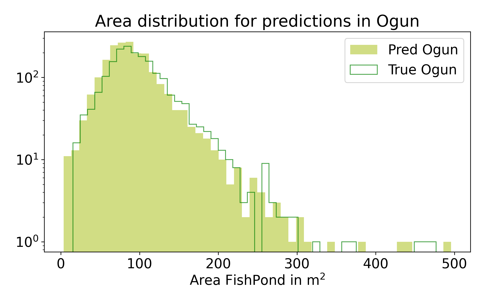

# FPAI

Story board

# Introduction 

  - Proposal motivation
  - Land cover change, Fish Ponds are replacing what on land?
  - Food sustainability: Location of ponds + dietary/nutrition information of nearby regions, increase # ponds $$ dietary needs in local population
  - General detection of areas with fish ponds: model trained with one state was able to detect some ponds on other states

# Fish Pond Census
  - Selection of states
  - Methods used for the census
  - Who made it
    
  

# Data extraction
  - How data was extracted (QGIS, Google satellite XYZ Titles)
  - Characteristics of the data (estimation date of data, size)
    - Total images per state
  - Data not usable for time series analysis

## Data manual Labeling
  - Roboflow
    

# Model Architectures 
## YOLO Model
  - YOLO models
  - YOLOv7
    
  
## SAM?

# Methodology
## Description of models
  - Model per state
  - Fine tuning strategies

# Training Details and Metrics
  - Darwin UDEL, GPU
  - Split train/test/valid
  - IoU, Average Precision
  - TP, FP, FN

## Ogun state
  - Total images, Split train/test/valid, number epochs
## Fine-tuning Delta state
  - Total images, Split train/test/valid, number epochs, fine tune strategie
## Fine-tuning Kwara state
  - Total images, Split train/test/valid, number epochs, fine tune strategie
## Trained all
  - Total images, Split train/test/valid, number epochs, fine tune strategie
## By geopolitica regions?

# Post-processing tasks for removing False Positives
  - NVDI?
  - Area?
  - Distances?
  - Size?

# Results

# Conclusion

  

