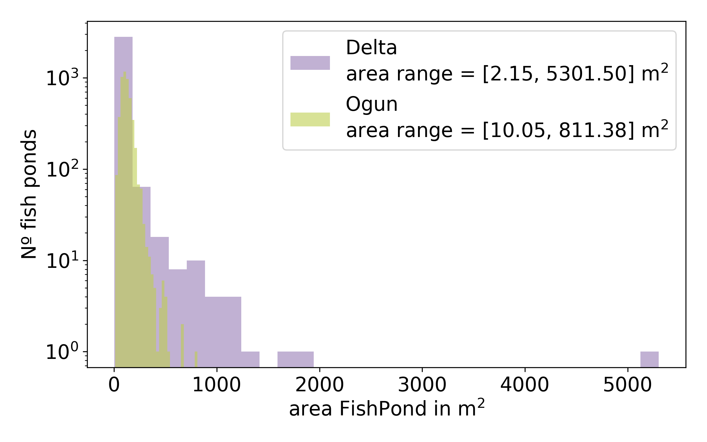
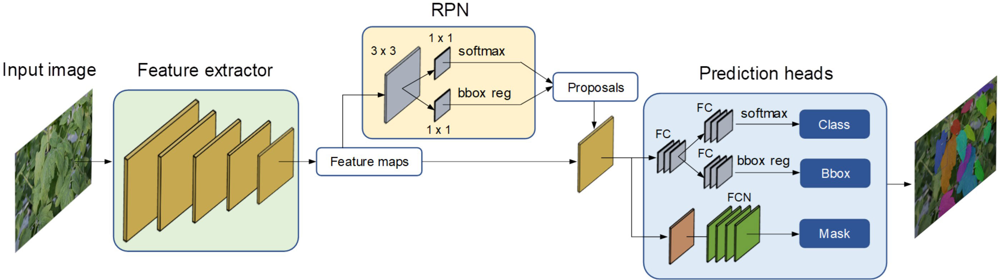

# FPAI

Story board

# Introduction 

  - Proposal motivation
  - Land cover change, Fish Ponds are replacing what on land?
  - Food sustainability: Location of ponds + dietary/nutrition information of nearby regions, increase # ponds $\propto$ dietary needs in local population
  - General detection of areas with fish ponds: model trained with one state was able to detect some ponds on other states

# Fish Pond Census
  - Selection of states
  - Methods used for the census
  - Who made it
    
  
  Figure 1: Nigeria and its 36 geopolitical states. In color are the states considered for this work and where we have information of Fish Ponds location from the WorldFish census.

  
  Figure 2: In bright green the boundary of Ogun state and in light blue the Fish Pond location. The location are later used to extract RGB images containing Fish Ponds.

# Data extraction
  - How data was extracted (QGIS, Google satellite XYZ Titles)
  - Characteristics of the data (estimation date of data, size)
    - Total images per state
  - Time analysis limitations of google satellite XYZ titles data

 

  Figure 3: Graph showing WorldFish Census -> Fish Ponds location per state -> Construction of Buffer around location -> Extraction of RGB images of size 2,000 x 2,000 pixels using: Python + QGIS + XYZ Tiles Google Satellite

## Data manual Labeling
  - Roboflow
    

Figure 2: Examples annotated images in Ogun State

Figure 3: Distribution number of Fish Ponds per image in all the states considered. There are on average XX amount of annotated Fish Ponds per image; the image with less Fish Ponds has XX and the one with more has XX annotated Fish Ponds. For Ogun states the team annotated 4,951 across X number of images. Delta state 2,981 across Y number of images, other states (maybe a table if we have several states.)

Figure 4: Distribution of annotated Fish Pond area in m2 across all the states considered in this work. In average the area of the Fish Pond is XX m2, with some outliers whose size is >5,000m2.

# Model Architectures 
## YOLO Model
  - YOLO models
  - YOLOv7
    
  
  Figure 5: YOLOv7 architecture, figure extracted from https://doi.org/10.3389/fpls.2023.1211075 
  
## SAM?

# Methodology
## Description of models
  - Model per state
  - Fine tuning strategies

# Training Details and Metrics
  - Darwin UDEL, GPU
  - Split train/test/valid
  - IoU, Average Precision
  - TP, FP, FN

## Ogun state
  - Total images, Split train/test/valid, number epochs
## Fine-tuning Delta state
  - Total images, Split train/test/valid, number epochs, fine tune strategie
## Fine-tuning Kwara state
  - Total images, Split train/test/valid, number epochs, fine tune strategie
## Trained all
  - Total images, Split train/test/valid, number epochs, fine tune strategie
## By geopolitica regions?

# Post-processing tasks for removing False Positives
  - NDVI?
  - Area?
  - Distances?
  - Size?

# Results

Figure 6: Loss curve per model

Figure 9:True area vs Predicted area per state

# Conclusion

  

