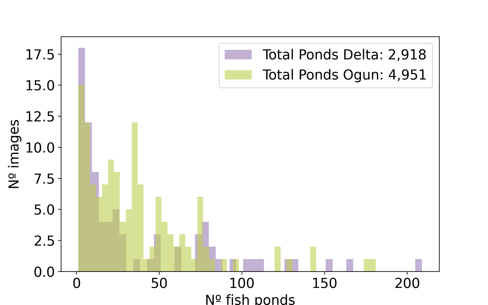

# FPAI

## What is the pipeline doing?
1. Select the state
2. Divide the state by grids of 6km $\times$ 6km
3. while num_predicitions >= 5000:
     for every grid:
        divide by grids of 200m $\times$ 200m (2000$\times$2000 pixels), each grid has 900 images of this size
        for every 2000$\times$2000 pixels images:
           extract the corresponding Google XYZ tiles
           use the 'fine_tune_ogun_delta_combine_freeze_v2' yolov7 model to predict fishponds in the grid
           convert mask to polygons
           save shape file of polygons
           update num_predicitions
     save shape file of all polygons for grid
   save shape file for predictions made on state

## How to run pipeline?
1. Requirements:
   The basis requirememts are:
   *  qgis=3.40.3
   *  geopandas=1.0.1
   *  folium=0.19.4
   *  pytorch=2.4.0
   *  rasterio=1.4.3
   The following files include the detail packages
        *  yolov7_qgis_2025_env.yml
        *  yolov7_qgis_2025_explicit.txt
        *  yolov7_qgis_2025_env_pip.txt
    
  2. Git clone https://github.com/taceroc/yolov7/tree/u7_tac_loss_gpu
  3. Download shape file of Nigeria division by states and save to data/Nigeria
  4. Download model 'fine_tune_ogun_delta_combine_freeze_v2'
  5. Run pipeline by, replace STATE by your desire state, as listed in the shape file of Nigeria*
     * sbatch -J STATE pred_all_state_random.sh predict_random_grid.py STATE 5000
     *NOTE: States with two or more words should be written without the space, e.g: Cross River should be written as CrossRiver 

# Introduction 

  - Proposal motivation
  - Land cover change, Fish Ponds are replacing what on land?
  - Food sustainability: Location of ponds + dietary/nutrition information of nearby regions, increase # ponds $\propto$ dietary needs in local population
  - General detection of areas with fish ponds: model trained with one state was able to detect some ponds on other states

# Fish Pond Census
  - Selection of states
  - Methods used for the census
  - Who made it
    
  
  Figure 1: Nigeria and its 36 geopolitical states. In color are the states considered for this work and where we have information of Fish Ponds location from the WorldFish census.

  
  
  Figure 2: In bright green the boundary of Ogun state and in light blue the Fish Pond location. The location are later used to extract RGB images containing Fish Ponds.

# Data extraction
  - How data was extracted (QGIS, Google satellite XYZ Titles)
  - Characteristics of the data (estimation date of data, size)
    - Total images per state
  - Time analysis limitations of google satellite XYZ titles data

 

  Figure 3: Graph showing WorldFish Census -> Fish Ponds location per state -> Construction of Buffer around location -> Extraction of RGB images of size 2,000 x 2,000 pixels using: Python + QGIS + XYZ Tiles Google Satellite

## Data manual Labeling
  - Roboflow
    

Figure 3: Examples annotated images in Ogun State

Figure 3a: Total area explored per state in km2 (number of images x pixel size) and the net area in km2 that have annotated fish ponds, in average the fish ponds cover ~9% of all the area explored. The areas explored here are targeted areas, given by the WorldFish census, we do not expected 9% of Nigeria being cover by FishPonds.

Figure 4: Distribution number of Fish Ponds per image in all the states considered. There are on average XX amount of annotated Fish Ponds per image; the image with less Fish Ponds has XX and the one with more has XX annotated Fish Ponds. For Ogun states the team annotated 4,951 across X number of images. Delta state 2,981 across Y number of images, other states (maybe a table if we have several states.)

Figure 5: Distribution of annotated Fish Pond area in m2 across all the states considered in this work. In average the area of the Fish Pond is XX m2, with some outliers whose size is >5,000m2.

# Model Architectures 
## YOLO Model
  - YOLO models
  - YOLOv7
    

   
  Figure 6: The YOLOv7 model is used as the pre-trained model to fine-tune by using images with annotated FishPonds. Figure extracted from https://doi.org/10.3389/fpls.2023.1211075 

  
## SAM?

# Methodology
## Description of models
  - Model per state
  - Fine tuning strategies

# Training Details and Metrics
  - Darwin UDEL, GPU
  - Split train/test/valid
  - IoU, Average Precision
  - TP, FP, FN

    
 
  
  Figure 7: Graph showing Methodology -> Extracted RGB images per states -> Roboflow Annotation -> Train/Valid/Test split -> Fine Tune per state the state-of-the-art instance segmentation model, the YOLOv7 -> output: masks -> masks to pixel polygon -> pixel to coordinates

## Trained all
  - Total images, Split train/test/valid, number epochs, fine tune strategie
## By geopolitica regions?

# Post-processing tasks for removing False Positives
  - NDVI?
  - Area?
  - Distances?
  - Size?

# Results

Figure 8: Test loss curve for each states considered here. 

Figure 9: Precision-Recall curve at different IoU thresholds for SS state. 

Figure 9a: Precision and Recall for the test data set per state. In average the models have a 90% recall and precision.

Figure 10a: True area vs Predicted area for the test data set for all the states considered in the work. The model is able to predict the Fish Ponds area distribution, including some of the outliers with larger sizes. 

Figure 10b: Prediction and True labels colored coded by classification class. False Positive predictions are embeded within the true area distribution, the model is predicting the correct size but not detecting true Fish Ponds.

(1).png)
Figure 11: Collage of images in different states showing examples of predictions, and true annotation in red.

# Conclusion

  

